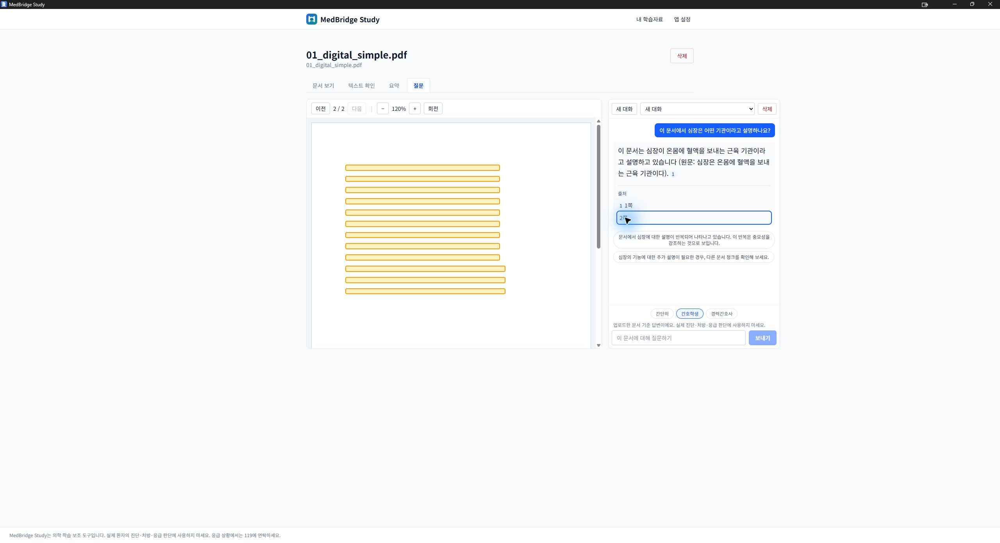
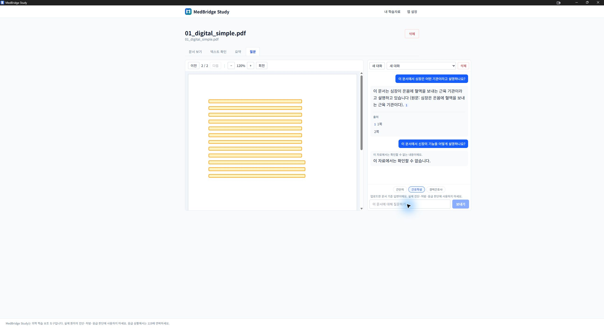

# PR #7 Windows 설치본 부분 검증 — 2026-09-08

판정: **HOLD**. CI는 통과했지만 한글 PDF 원문이 빈 화면으로 표시됐다.
아래는 실제 설치본의 관찰 기록이며, 소스 수정 검증이나 36항목 전체 통과와 구분한다.

## 설치본 식별과 데이터 보존

- [CI run 34196702692](https://github.com/chorok446/medbridge/actions/runs/34196702692):
  versions/backend/frontend/security/windows-build/summary 모두 성공.
- PR HEAD: `740ac57ceaf8aacd5991f3f2aba54be1c071bf0d`.
- manifest testedCommit: `8f0cd9ed9f799ef52ab150b102a1f444d67e289a`
  (GitHub의 PR merge 커밋). 부모에 위 HEAD가 포함되며, 양쪽 소스 tree는
  `be5c2babe93c3c40c7fc88b77a3e03433c06e03f`로 동일함을 확인했다.
- 설치 파일: `MedBridge Study_0.1.0_x64-setup.exe`, 103,755,055 bytes.
  SHA-256: `68faba1cb52e36409f1f8eafdf332dd43bbb27ade091ac86399a860738cebddb`.
  installer와 테스트 PDF 7개의 크기·해시가 manifest와 일치했다.
  GitHub artifact 압축 파일 자체의 digest는 별도로 검증하지 않았다.
- Authenticode는 NotSigned. 사용자 승인 후 NSIS의 재설치 경로로 설치했다.
  설치 완료와 앱 실행을 확인했으나, 개발 도구가 없는 PC나 비관리자 계정 검증은 아니다.
- 설치 전 기존 앱을 종료한 상태에서 데이터와 이전 설치 폴더를 백업했다.
  백업명 `pr7-740ac57-20260908-preupdate`, 92파일 / 9,178,547,685 bytes이며
  복사본 전부를 SHA-256으로 검증했다. 이전 백업도 보존했다.
- 업데이트 직후 문서 11행, 페이지 4,337행, 블록 364,788행과 모델 설정의
  전체 테이블 내용 해시가 설치 전과 동일했다. DB `quick_check=ok`, FK 위반 0,
  migration `0015`. 기존 Q&A 테이블은 비어 있어 **Q&A 이력의 업데이트 보존은 미검증**이다.
- 이후 합성 PDF 1개를 추가하고 검색을 준비했으며, 기본 모델 활성화와 Q&A 2건을
  실행했다. 이 정상적인 검증 변경을 업데이트 직후의 동일 해시 판정과 혼동하지 않는다.

## 환경과 실제 관찰

- Windows 11 Pro 10.0.26200, RAM 약 31.1 GiB, Ryzen 5 9600X, RTX 3080.
- Ollama 0.33.3, 기존 설치 모델 qwen3:8b. 모델 삭제·재다운로드는 하지 않았다.
- 로컬 AI 설정 첫 진입에서 상태 확인 실패 안내가 한 번 표시됐다.
  다시 시도 후 설치 모델 목록이 표시됐고 연결 테스트·기본 모델 활성화가 성공했다.
  별도 읽기 전용 `/api/version` 검사 20회는 모두 성공했다(0.023~0.057초).
  첫 실패 원인은 확정하지 않았으며, 재시도 성공을 원인 수정으로 기록하지 않는다.
- 합성 테스트 파일 `01_digital_simple.pdf`(2쪽, 7,434 bytes)를 GUI로 추가했다.
  SHA-256: `191fb25f622107bd52154254c5c779e8a726b21f699e4e844d9815fd8e84ee7b`.
  자동 추출은 완료됐고 텍스트 확인 패널에는 한글 본문이 정상 표시됐다.
- 검색 준비 전 질문은 준비 안내로 차단됐지만 입력 질문이 사라졌다.
  텍스트 확인에서 문서 검색 준비를 완료한 뒤 Q&A를 실행했다.
- 근거형 질문은 문서에 있는 심장의 설명을 답변했고 출처 배지를 표시했다.
  2쪽 출처 클릭 후 페이지 표시가 `2 / 2`로 바뀌고 하이라이트가 나타났다.
  하지만 글자가 없어 실제 원문 확인은 불가능했다.
- 문서에 없는 신장 기능 질문에는 확인할 수 없다는 보류 안내만 표시됐다.
  해당 응답에 일반 지식 답변·출처 배지·후속 질문은 표시되지 않았다.
- 검증 후 읽기 전용 DB 검사에서도 `quick_check=ok`, FK 위반 0이었다.
  Q&A는 대화 1개 / 메시지 4개 / claim 1개이며 메시지 상태는 `completed` 3개
  (사용자 질문 포함), `not_found` 1개였다. 로컬 모델 설정 내용 해시는 유지됐다.
- 앱 기본 창 크기에서는 질문 패널이 가로로 잘렸다. 최대화 후 검증을 진행했다.
  근거형 응답의 후속 질문 영역에 질문 대신 설명 문장이 표시된 것도 후속 검토 대상이다.
- cold/warm 응답 시간은 계측하지 않았다. 스트리밍 도중의 출처 배지 표시도
  포착하지 않았으므로 완료 화면을 스트리밍 검증 근거로 사용하지 않는다.

## 36항목 체크리스트 반영

| 항목 | 판정 | 근거 또는 남은 조건 |
|---|---|---|
| 1 | 부분 | 업데이트 설치 성공. 깨끗한 비관리자 PC는 미검증 |
| 2~9 | 보류 | Ollama 미설치·다운로드·취소 시나리오 미실행 |
| 10 | 부분 | 기존 설치 모델 목록 확인. 새 다운로드 완료는 미검증 |
| 11, 12 | 통과 | 연결 성공 및 기본 모델 활성화 안내 확인 |
| 13 | 부분 | 한국어 답변 성공. 원문 PDF 렌더링 실패 |
| 14, 15 | 보류 | 영어·표 수치 질문 미실행 |
| 16 | 통과 | 합성 문서의 근거 부재 질문 1건 보류 |
| 17~19 | 보류 | 부정·상충 및 스트리밍 중 배지 표시 미검증 |
| 20 | 실패 | 페이지 이동·하이라이트는 동작하나 원문 글자가 보이지 않음 |
| 21~35 | 보류 | 취소·강제 종료·복구·오프라인·연속 질문·메모리 검증 미완료 |
| 36 | 부분 | 기존 문서·설정 보존 확인. 기존 Q&A 이력은 없어 미검증 |

## PDF 빈 화면의 원인과 소스 수정 검증

수정 커밋: `1d5b9f9` (`fix(pdf): 한글 렌더링 리소스를 앱에 포함한다`).

`PdfViewer`의 `getDocument({ url })`에 CMap 경로가 없었고 정적 산출물에도
PDF.js 리소스가 포함되지 않았다. 글꼴이 내장되지 않은 합성 한글 PDF에서
`Ensure that the cMapUrl API parameter is provided` 경고와 본문 누락을 재현했다.

- 잠금 파일의 PDF.js 6.2.108에서 CMap·기본 글꼴·WASM·라이선스를 dev/build 전에
  `public/pdfjs`로 복사한다. CDN 요청이나 별도 모델·OS 글꼴 설치에 의존하지 않는다.
- 뷰어는 현재 앱 origin의 절대 리소스 URL을 전달한다. worker 경로·문서 로드 수명·
  회전·출처 좌표 계약은 변경하지 않는다. 의존성 및 lockfile 변경은 없다.
- 회귀 테스트는 수정 전 리소스 인자 누락으로 실패했다. 수정 후 새 테스트 2개 통과.
  전체 Web 29파일 / 213테스트, ESLint, TypeScript, production build 모두 통과했다.
- 정적 export의 리소스 199파일 / 3,503,550 bytes를 원본과 비교했고 해시 불일치 0건.
- 같은 PDF의 첫 페이지 상단 700px를 PDF.js 6.2.108의 Node용 legacy 빌드와
  canvas로 비교했다. 리소스 없음: 본문 어두운 픽셀 0 / 텍스트 항목 1.
  내보낸 리소스 적용: 9,791픽셀 / 190항목. 이는 렌더러 수준 진단이며
  **수정 후 Tauri/WebView2 설치본 검증을 대체하지 않는다**.

## 다음 검증

1. 수정 커밋의 CI와 새 installer·manifest 식별 정보를 다시 확인한다.
2. 새 설치본에서 같은 PDF의 한글 본문, 페이지 이동·회전·확대와 출처 위치를 확인한다.
3. 이번에 생성한 합성 Q&A 이력을 포함해 업데이트 보존을 재검증한다.
4. 미완료 36항목, 첫 상태 확인 실패, 기본 창 레이아웃과 후속 질문 품질을 검증한다.

승인 파일 생성·Ready 전환·병합·공개 릴리스는 하지 않는다.
