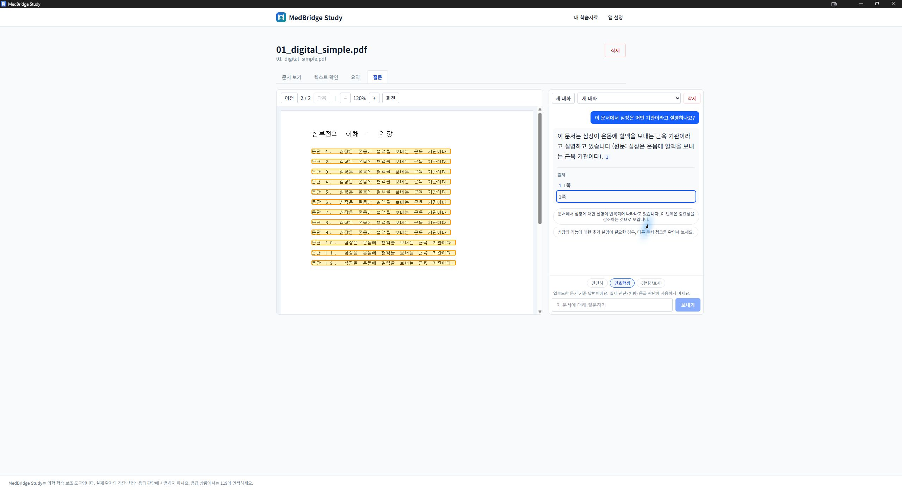
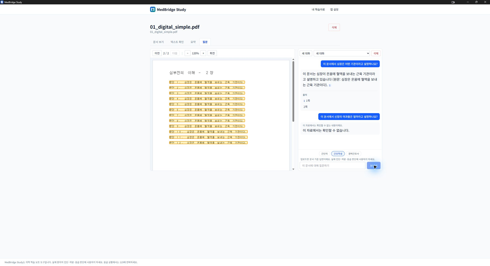
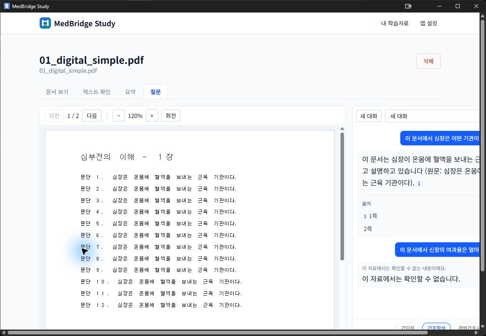

# PR #7 Windows 새 Q&A 및 재실행 검증 — 2026-09-09

판정: **새 로컬 Q&A·업데이트/정상 재실행 데이터 보존 부분 통과 / 출시 HOLD**.
사용자가 직접 업데이트 설치와 실행을 완료한 뒤 설치된 앱을 검증했다.
컴퓨터 사용 도구로 관찰한 GUI 결과와 읽기 전용 DB 검사를 구분해 기록한다.
전체 36항목, 비관리자 설치, Ollama가 없는 깨끗한 PC의 통과를 의미하지 않는다.

## 설치본과 검증 환경

- [CI 34301844214](https://github.com/chorok446/medbridge/actions/runs/34301844214):
  versions/backend/frontend/security/windows-build/summary 모두 성공.
- PR HEAD: `35362c1a4ca58a0bca77071dc5d0b5f8a9faac16`.
- manifest testedCommit: `ab66db66f39abe9508ff79f6574338c767774b24`.
  GitHub PR merge 커밋의 부모에 위 HEAD가 포함되며, 두 tree는
  `2e47a7b0054af7ebbb866ffaea1b7db5c402b451`로 동일하다.
- artifact: `medbridge-windows-setup`, ID `10085570681`.
  installer와 PDF 7개의 크기·SHA-256이 manifest와 일치했다.
  다운로드된 artifact 압축 파일 자체의 digest는 별도로 검증하지 않았다.
- 설치 파일: `MedBridge Study_0.1.0_x64-setup.exe`, 105,734,962 bytes.
  SHA-256: `9dd3b6b369234eef7c8ff727deb1a36418c9f82eb0048b217a6731b8e5191886`.
  Authenticode는 NotSigned다.
- 자동 실행 시도는 Computer Use 앱 승인 시간 초과로 중단됐다. 이후 사용자가
  직접 설치·실행했다고 확인했다. 설치 화면 선택과 UAC 여부를 직접 관찰하지
  않았으므로 자동 설치 성공이나 관리자 권한 불필요로 기록하지 않는다.
- 설치된 `medbridge.exe`: 15,316,480 bytes,
  SHA-256 `d0c07aaeae21c7e69fc41e929ba20c079168e7b88b15f1f9ffb9e1dc2a69907a`.
- 설치된 `medbridge-sidecar.exe`: 45,720,463 bytes,
  SHA-256 `3a85d8df1a8896982a9ea8d2dfb06c7508b9559f4339a68a78593093bd360444`.
  두 파일 모두 직전 c97aee6 설치본과 달라졌다. installer 내부 payload를 추출해
  설치 파일과 별도로 대조한 것은 아니다.
- 직전 검증과 같은 Windows 11 Pro / Ryzen 5 9600X / RAM 약 31.1 GiB /
  RTX 3080 개발 PC다. 기존 Ollama 0.33.3 / 활성화된 로컬 qwen3:8b를 사용했다.
  앱의 모델·보안·개인정보 설정은 변경하지 않았다.

## 업데이트 전 백업과 기존 데이터 보존

- 앱·sidecar가 종료된 상태에서 데이터와 이전 설치 폴더를 백업했다.
  백업명 `pr7-35362c1-20260909-preupdate`, 93파일 / 9,180,103,292 bytes.
  모든 복사본의 SHA-256을 검증했고 이전 백업을 덮어쓰거나 삭제하지 않았다.
- 설치 직전 DB와 백업 manifest의 해시가 일치했다. 설치 직후 새 질문을 만들기
  전에는 documents/pages/blocks/qa_threads/qa_messages/qa_claims/settings
  7개 테이블의 행 수와 전체 내용 해시가 백업과 일치했다.
  기준 해시는 [직전 보고서의 표](windows-pr7-validation-20260909-c97aee6.md)에
  기록된 값과 같다. migration은 `0015`다.
- 새 질문 5개를 만든 뒤에도 documents 12행, document_pages 4,339행,
  document_blocks 364,816행, summary_settings 1행은 백업과 전체 내용 해시가
  같았다. 기존 Q&A thread 1행 / message 4행 / claim 1행도 ID별 전체 값이
  그대로였다. 새 합성 Q&A만 추가됐다.
- 읽기 전용 검사에서 `quick_check=ok`, FK 위반 0을 확인했다.
  모든 DB 테이블과 업로드 파일 전체의 설치 후 해시를 검사한 것은 아니다.

## 설치된 앱에서 새 질문 5회

직전과 같은 기존 합성 `01_digital_simple.pdf`(2쪽, 7,434 bytes)를 사용했다.
SHA-256: `191fb25f622107bd52154254c5c779e8a726b21f699e4e844d9815fd8e84ee7b`.
본문은 심장이 온몸에 혈액을 보내는 근육 기관이라는 문장을 반복한다.
신장 여과율이나 구체적인 작동 기전은 없다. 실제 환자 자료는 사용하지 않았다.

| 순서 | 합성 질문 | DB 결과 | 생성→완료 시간 | 판정 |
|---|---|---|---:|---|
| 1 | 이 문서에서 심장은 어떤 기관이라고 설명하나요? | completed | 9.328초 | 근거형 한국어 답변·1/2쪽 출처 표시 통과 |
| 2 | 문서의 1장과 2장을 바탕으로 심장의 기능에 대한 설명을 문단별로 자세히 정리해 주세요. | not_found | 0.016초 | 관련 본문이 있는데 보류됨; 검색/질문 표현 진단 필요 |
| 3 | 심장은 어떤 기관인가요? 문서의 원문을 인용하고 핵심 내용을 자세히 설명해 주세요. | completed | 1.739초 | 원문 인용과 출처 표시 통과 |
| 4 | 1번과 같은 질문, 새 대화 | completed | 6.397초 | 모델 메모리 해제 후 재로딩·답변 통과; 취소는 미확인 |
| 5 | 이 문서에서 신장의 여과율은 얼마라고 설명하나요? | not_found | 2.922초 | 없는 내용을 만들지 않고 근거 부재 안내 통과 |

시간은 DB의 `created_at`과 `completed_at` 차이며 GUI 전체 지연이나 정식 성능
벤치마크가 아니다. 첫 질문의 cold 여부는 확정하지 않았다. 4번 전에는 pending이
0임을 확인하고 `ollama stop qwen3:8b`로 메모리에서만 모델을 내렸다. `ollama ps`
목록이 빈 것을 확인했지만 OS 파일 캐시는 남아 있으므로 완전한 cold boot는 아니다.
모델 파일을 삭제하거나 재다운로드하지 않았다.

1번 답변의 2쪽 출처를 눌렀을 때 `2 / 2`로 이동했고, 한글 원문 12줄과 하이라이트가
정렬됐다. 새 대화·질문 입력도 정상 동작했다. 생성 중에는 대화 전환·삭제·질문 입력이
비활성화된 모습을 관찰했지만 스트리밍 중 출처 배지의 점진 표시는 별도 확인하지 못했다.

취소를 시도한 질문들은 취소 요청이 기록되기 전에 완료됐다. 새 메시지 모두
`cancel_requested_at=null`이고 `cancelled` 상태는 없었다. 따라서 중단 버튼을
누르려 시도한 사실을 취소 성공으로 계산하지 않는다. 취소 후 새 질문도 미검증이다.

## 정상 종료·재실행

- 질문 5회 종료 후 pending 메시지와 active Q&A thread가 모두 0이었다.
- GUI의 정상 종료(Alt+F4) 후 `medbridge`와 `medbridge-sidecar` 프로세스가
  모두 없음을 확인했다. 외부 연결 전체를 추적한 검증은 아니다.
- 기존 설치 앱을 다시 실행하고 같은 합성 PDF를 열었다. 새 근거형 답변과 근거
  부재 답변이 다시 표시됐다. 모델 설정과 문서 관련 4개 테이블은 계속 백업과 같았다.
- 재실행 직전·직후 아래 3개 Q&A 테이블의 전체 내용 해시가 모두 일치했다.
  기존 이력과 이번에 생성한 새 이력을 함께 비교했다.

| 테이블 | 행 수 | 정상 재실행 전후 SHA-256 |
|---|---:|---|
| qa_threads | 3 | `0045bb44d71487cf34596077d20794b04120517b50ece25ed479937214f4cbdd` |
| qa_messages | 14 | `e34da46e03e7e356ee697efa49c9fdcaa8325f3bdf9a898f669a2596d0eda092` |
| qa_claims | 4 | `a951e4af85716024227133f3bf0b4d0af210d336074b7f29b2775bab462c27e0` |

재실행 뒤에도 `quick_check=ok`, FK 위반 0, pending 0이었다.
이는 정상 종료·재실행 검증이지 생성 도중 강제 종료·interrupted 복구 검증이 아니다.
최종적으로 앱을 다시 실행해 합성 Q&A 화면을 열어 둔다.

## 관찰된 문제와 다음 작업

1. **좁은 창의 질문 패널 잘림**: 재실행 기본 약 1,200px 창에서도 오른쪽 답변과
   입력 영역이 화면 밖으로 나간다. 최대화하면 확인할 수 있다. PDF와 Q&A 패널의
   최소 폭·반응형 배치를 별도 수정하고 기본 창·작은 화면에서 회귀 검증해야 한다.
2. **후속 질문 품질**: 1·4번 답변 뒤 버튼이 질문 대신 안내문/설명문으로 나왔다.
   3번은 질문 형식이지만 이 문서에 없는 구조·기전을 묻는 내용이었다.
   후속 질문의 형식과 문서 근거 범위를 별도로 검증해야 한다.
3. **관련 질문의 너무 이른 보류**: 2번은 본문에 심장 기능 설명이 있는데도
   0.016초에 not_found가 됐다. 원인을 모델 실패로 단정하지 않고 검색 결과·
   질문 전처리 경로를 합성 재현으로 조사해야 한다. 안전 검증은 완화하지 않는다.

## 36항목 반영 범위

- [Windows 체크리스트](windows-sprint4c-qa-release-validation.md)의 13·16·20번은
  이번 합성 문서의 새 답변·근거 부재·2쪽 이동 범위에서 통과했다.
- 36번은 이번 업데이트의 기존 이력/설정 보존과 정상 재실행 후 새 이력 보존을
  확인했다. 새 설치나 데이터가 없는 환경으로 확대하지 않는다.
- 34번은 종료 후 앱·sidecar 프로세스 부재만 확인한 부분 검증이다.
  12·27번은 기존 로컬 활성화 설정으로 질문이 동작한 것이며, 활성화 버튼 재실행이나
  외부 AI 동의 상태의 별도 검증을 대신하지 않는다.
- 21·22번 취소, 23~25번 강제 종료/복구, 29번 연속 10회, 오프라인·메모리·
  미설치/다운로드 경로와 서로 다른 실제 300MB 이상 문서 부하 검증은 남아 있다.
- 미실행 항목과 기존 실패를 통과로 바꾸지 않는다. 이번 검증 문서·합성 화면 증거
  외의 제품 코드는 변경하지 않는다. PR Draft, 출시 HOLD, 승인 파일 미생성을 유지한다.
