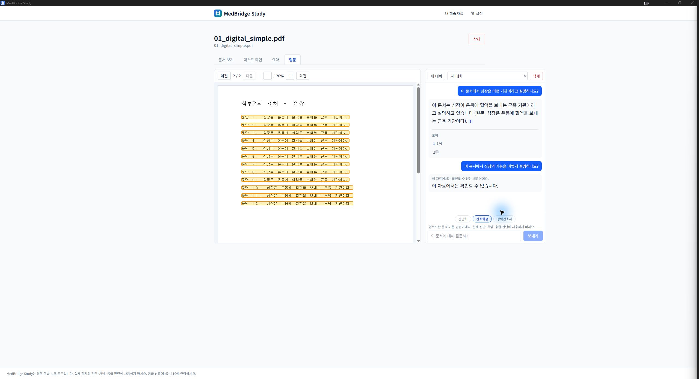
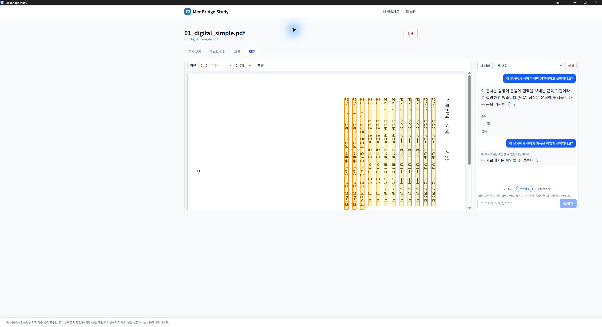

# PR #7 Windows PDF 수정 재검증 — 2026-09-09

판정: **PDF 수정 및 업데이트 데이터 보존 통과 / 전체 출시 HOLD**.
이번 검증은 설치본의 한글 원문·출처 표시와 기존 Q&A 보존에 한정한다.
36항목 전체 통과나 깨끗한 PC의 설치 검증을 의미하지 않는다.
[직전 실패 기록](windows-pr7-validation-20260908-740ac57.md)은 그대로 보존한다.

## 설치본 식별과 설치 절차

- [CI run 34232145369](https://github.com/chorok446/medbridge/actions/runs/34232145369):
  versions/backend/frontend/security/windows-build/summary 모두 성공.
- PR HEAD: `c97aee66e9301f409c52d817fd87d553fbe0128e`.
  PDF 리소스 수정 `1d5b9f9`와 직전 검증 문서 커밋을 포함한다.
- manifest testedCommit: `8529f9f2516bb4c284d9316752bdf7bd2ee08a02`
  (GitHub PR merge 커밋). 부모에 위 HEAD가 포함되며, 양쪽 tree는
  `06c74224ee2a9306f8e0ab4161921a9efee87294`로 동일하다.
- artifact: `medbridge-windows-setup`, ID `10059029718`.
  installer 및 테스트 PDF 7개의 크기·SHA-256이 manifest와 일치했다.
  GitHub artifact 압축 파일 자체의 digest는 별도로 검증하지 않았다.
- 설치 파일: `MedBridge Study_0.1.0_x64-setup.exe`, 105,734,000 bytes.
  SHA-256: `cf3737478f31622b4fb78089f9a28b1cce102b065f151a7772a9f23f183f43de`.
- Authenticode는 NotSigned. 사용자 승인 후 NSIS의 컴포넌트 추가 및 재설치로
  기존 위치에 업데이트했다. 제거 경로는 선택하지 않았다.
  설치 완료·앱 자동 실행을 확인했고 바탕 화면 바로가기는 추가하지 않았다.
  이 실행에서 UAC·SmartScreen 경고는 관찰되지 않았으며 우회하지 않았다.
- 설치된 `medbridge.exe`: 15,320,576 bytes,
  SHA-256 `531ea8d1850fc6f216286efbfb64fc43f9723f7eb762920b1143a5ef12cdb482`.
- 설치된 `medbridge-sidecar.exe`: 45,718,633 bytes,
  SHA-256 `8f03b50372ce350432ee6eb10b6b5cf3a9a0f17f721c1906aa0613ea559af727`.
- 환경: Windows 11 Pro 10.0.26200, RAM 약 31.1 GiB, Ryzen 5 9600X, RTX 3080.
  기존 Ollama 0.33.3 / qwen3:8b를 유지했다. 개발 PC의 업데이트 검증이며,
  개발 도구·Ollama가 없는 PC나 비관리자 계정 검증은 아니다.

## 백업 및 비어 있지 않은 Q&A 이력 보존

- 앱과 sidecar가 종료된 상태에서 데이터와 이전 설치 폴더를 백업했다.
  백업명 `pr7-c97aee6-20260909-preupdate`, 93파일 / 9,178,232,718 bytes.
  복사본 전체의 SHA-256을 검증했으며 이전 백업도 보존했다.
- 설치 직전 원본 DB가 백업 manifest의 해시와 일치함을 재확인했다.
- 설치 후와 화면 검증 종료 후 읽기 전용 DB 검사 결과:
  `quick_check=ok`, FK 위반 0, migration `0015`.
- 아래 7개 테이블은 기본 키 순으로 전체 행을 직렬화한 내용 해시와 행 수가
  설치 전 백업과 모두 일치했다. 단순 행 수 비교만으로 보존을 판정하지 않았다.

| 테이블 | 행 수 | 설치 전후 전체 내용 SHA-256 |
|---|---:|---|
| documents | 12 | `0c85b5bab5f35b9f1873dc0276ea51015121e89c8aa33ae9b57d873be2795ad1` |
| document_pages | 4,339 | `4fb2b50fc8db27ddbe31d98035588d27519a929808371596fe4047bc021e1bdb` |
| document_blocks | 364,816 | `1d1ea4b62b17682540e5590cde88d009fbdf98795589642f5ccf4293cc9d4538` |
| qa_threads | 1 | `8b6e6bbc7e1d625f350afff168fc94d945fe3e22ba3ee2601ed69c44cc0e82ca` |
| qa_messages | 4 | `3f4fc9293527c72ce08833025dc6c5075293ca356b20867b0ff0c6fb6432e0eb` |
| qa_claims | 1 | `f67e60baf163a81ba57a1547fbd15d4c432da70b5908ce335c0db3a975391ee3` |
| summary_settings | 1 | `81ff5a90db10b3a83102e2ff05e5a1443c01f1bd8b5c12404cb3ea180e2b2421` |

저장된 근거형 답변과 근거 부재 보류 답변을 앱에서 다시 확인했다.
메시지 상태는 `completed` 3개(사용자 질문 포함), `not_found` 1개로 유지됐다.
로컬 qwen3:8b 활성화 설정도 동일했다. 이번 실행에서는 새 질문 생성·문서 추가·
모델 변경을 하지 않았으므로 기존 답변 표시를 새 모델 생성 성공으로 계산하지 않는다.
다른 DB 테이블 전체의 내용 해시나 업로드 원본 전체의 설치 후 해시까지 비교한 것은 아니다.

## 같은 PDF를 사용한 화면 재검증

새 테스트 키트 파일로 바꾸지 않고, 직전 설치본에서 빈 화면을 재현했던 기존
`01_digital_simple.pdf`를 그대로 열었다(2쪽, 7,434 bytes).
SHA-256: `191fb25f622107bd52154254c5c779e8a726b21f699e4e844d9815fd8e84ee7b`.
스크린샷은 이 합성 문서와 합성 Q&A만 포함하며 사용자 문서·DB 파일은 첨부하지 않는다.

| 확인 항목 | 결과 |
|---|---|
| 한글 원문 | 1쪽·2쪽 제목과 본문이 실제 Tauri/WebView2 설치본에 표시됨 |
| 2쪽 출처 | 클릭 후 `2 / 2`로 이동하고 본문 12줄에 하이라이트 정렬 |
| 확대 | 120% → 140%에서 한글과 하이라이트가 함께 확대됨 |
| 회전 | 140% / 90도에서 한글과 하이라이트가 함께 회전한 화면 확인 |
| 보기 복귀 | 회전 버튼으로 원래 방향 복귀 후 120%로 축소, 본문 표시 유지 |
| 1쪽 출처 | 클릭 후 `1 / 2` 및 1장 제목으로 변경, 본문 하이라이트 유지 |
| 기존 답변 | 업데이트 전 근거형 답변·출처 및 보류 답변이 그대로 표시됨 |

180도·270도는 원래 방향으로 돌아오는 과정에서 거쳤지만, 각 방향의 페이지 전체를
스크롤해 검증하지 않았다. 모든 회전·배율 조합의 통과로 확대 해석하지 않는다.

## 체크리스트 반영과 남은 범위

- [Windows 36항목 체크리스트](windows-sprint4c-qa-release-validation.md)의
  20번은 이번 합성 문서의 1쪽·2쪽 출처 이동 및 실제 원문 표시까지 통과했다.
- 36번은 이번 업데이트에서 기존 문서·Q&A 이력·모델 설정 보존을 확인했다.
  직전 기록의 빈 Q&A 이력에 따른 미검증 조건을 해소했다.
- 1번은 업데이트 설치만 확인했으므로 여전히 부분 검증이다.
  나머지 항목을 이번 결과만으로 일괄 통과 처리하지 않는다.
- 기본 약 1,200px 폭의 창에서 질문 패널이 가로로 잘리는 문제는 남아 있다.
  확대·회전 시 문서 폭에 따라 가로 넘침이 증가하며 최대화 후 전체 패널을 확인했다.
- 직전 로컬 AI 첫 상태 확인 실패, 검색 준비 전 질문 소실, 후속 질문 품질은 미해결이다.
- 새 설치본의 새 Q&A 생성·스트리밍·취소·복구·오프라인·연속 질문·메모리 검증,
  Ollama 미설치·다운로드 경로, 서로 다른 실제 300MB 이상 문서의 부하 검증은 남아 있다.

이번 변경은 검증 문서와 합성 화면 증거뿐이다. 애플리케이션 코드는 수정하지 않는다.
출시 **HOLD**와 PR **Draft**를 유지하고 승인 파일 생성·병합·공개 릴리스는 하지 않는다.
