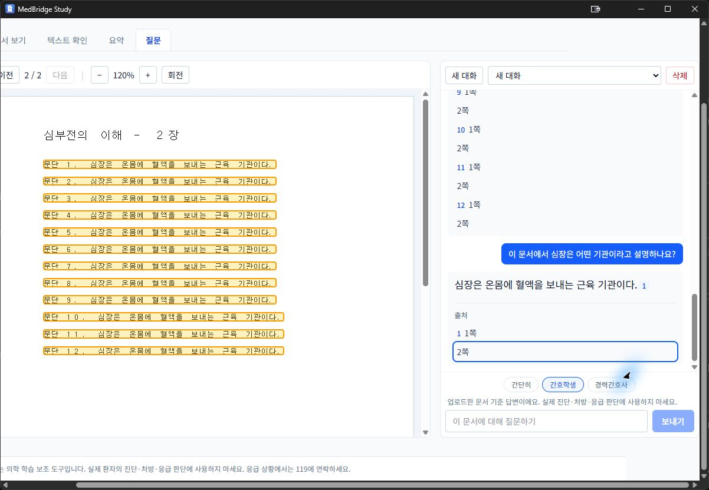
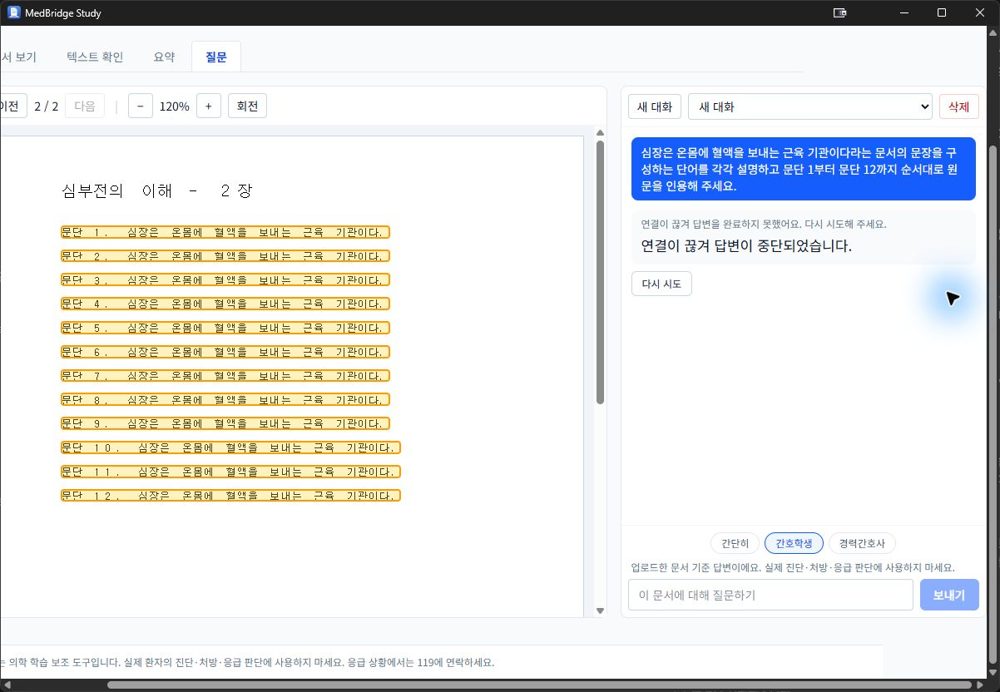

# PR #7 Windows 문단 인용 복원 설치본 검증 — 2026-09-09

판정: **문단 인용·중복 제거 부분 통과 / 취소 상태 실패 / 출시 HOLD / PR Draft 유지**.
아래는 새 설치본의 실제 GUI와 읽기 전용 DB 검증 기록이다.
이전 고정 커밋의 39/39 모델 평가나 전체 Windows 36항목 통과와 구분한다.

## 설치본 식별

- [CI 34331106221](https://github.com/chorok446/medbridge/actions/runs/34331106221):
  versions/backend/frontend/security/windows-build/summary 6개 job 모두 성공.
  마지막 완료 시각은 2026-09-09 09:09:49 UTC다.
- 설치 검증 대상 PR HEAD: `d564828952ccddb110ed3abcd3b5f844f0881bcd`.
  마지막 제품 코드 수정은 `e22eef0f5f4ee6eeb08012065e84b0abf956f3ed`다.
- manifest의 merge SHA: `4b5ecfd628d498d523489c42975c70fcaef35315`.
  merge와 PR HEAD의 tree는 `e64f882699f7990eb7766d5c4217d0af972dda7d`로 같다.
- installer: `MedBridge Study_0.1.0_x64-setup.exe`, 105,746,518 bytes.
  SHA-256: `9265ad2d6d918c8235810de6d3f668c384bcf30d99765c3fd355494bd0cf2811`.
  Authenticode는 NotSigned다. 정식 서명 릴리스로 취급하지 않는다.
- installer와 testKit PDF 7개의 크기·SHA-256이 manifest와 일치한다.
- 사용자에게 새 실행·업데이트 설치의 직전 승인을 받은 뒤 Computer Use로 진행했다.
  기존 경로의 컴포넌트 추가·재설치를 선택했고 성공·완료·앱 실행을 확인했다.
  제거·초기화·추가 바탕화면 바로가기는 선택하지 않았다. UAC·보안 경고는 관찰되지 않았다.
  깨끗한 PC의 최초 설치나 비관리자 계정 검증을 의미하지 않는다.

| 설치 후 파일 | 크기(bytes) | SHA-256 |
|---|---:|---|
| medbridge.exe | 15,316,480 | `cc0523d7dcfba576f3e26197eda463456c375b5edcbb26057be04e412e6a1bbf` |
| medbridge-sidecar.exe | 45,727,397 | `3c85c69b7affa55655f9d5f96c2fc8361e23cb2ca5e8a8b8fdc9c344181682c2` |

## 백업과 업데이트 직후 보존

- 앱·sidecar 종료 상태에서 별도 `pr7-d564828-20260909-preupdate` 백업을 만들었다.
  93파일 / 9,232,153,030 bytes의 복사 전·후 원본과 사본 SHA-256이 모두 같았다.
  기존 백업을 덮어쓰거나 삭제하지 않았다.
- 실행 직전 DB·WAL·SHM과 설치본 등 80개 핵심 파일을 백업 manifest와 재대조했다.
  설치 파일 해시도 다시 확인했다.
- 업데이트 후 새 질문 전 문서 12개 / 페이지 4,339개 / 블록 364,819개 /
  모델 설정 1개와 대화 8개 / 메시지 38개 / claim 89개의 모든 내용이 백업과 같다.
  7개 테이블 전체 내용 해시를 비교했으며 과거의 잘못된 답변도 수정하지 않았다.
- DB quick_check=ok, FK 위반 0, pending/streaming/finalizing 합계 0이다.
  모델은 활성화된 local qwen3:8b, 학습 수준은 간호학생으로 유지했다.

## 동일 합성 문서와 질문

- 이전 실패 때 사용한 기존 `01_digital_simple.pdf`, 2쪽 / 7,434 bytes다.
  SHA-256: `191fb25f622107bd52154254c5c779e8a726b21f699e4e844d9815fd8e84ee7b`.
  새 kit의 PDF로 바꾸거나 다시 추출하지 않았다.
- 두 페이지는 문단 1~12에 “심장은 온몸에 혈액을 보내는 근육 기관이다.”를 반복한다.
  산소·영양 운반이나 수축·이완 설명은 원문에 없다.
- 긴 질문은 각각 새 대화에서 다음 문구 그대로 실행한다.

> 심장은 온몸에 혈액을 보내는 근육 기관이다라는 문서의 문장을 구성하는 단어를 각각 설명하고 문단 1부터 문단 12까지 순서대로 원문을 인용해 주세요.

## 검증 결과

[재시도·후속 질문까지의 읽기 전용 결과와 보존 수치](windows-pr7-answers-20260909-d564828.json).
취소 실패는 아래 별도 재시도 전 JSON을 기준으로 한다.

| 질문 | 시작(UTC) | 생성 구간(초) | 최종 상태 | 저장 claim |
|---|---|---:|---|---:|
| 긴 질문 1 | 10:56:18.132673 | 39.861 | completed | 12 |
| 긴 질문 2 | 11:00:34.993220 | 39.490 | completed | 12 |
| 긴 질문 3 | 11:02:28.345941 | 35.155 | completed | 12 |

- 긴 질문 **3/3 통과**. 각 응답의 claim_index 0~11과 정확한 문단 1~12 원문,
  supported 상태·비어 있지 않은 출처, 최종 본문·draft 비움을 읽기 전용으로 확인했다.
  각 인용에는 같은 원문이 있는 1·2쪽 출처가 저장됐다.
- 새 36개 claim 모두 문서 원문과 일치한다. 문서 밖 단어 정의를 답하지 않았고,
  같은 문장·같은 출처 집합의 중복 0개다. 과거의 잘못된 답변은 그대로 남아 있다.
- 시간은 stream_started_at~completed_at이며 클릭 지연이나 cold 측정값이 아니다.
  Ollama 0.33.3 / qwen3:8b 모델 digest는 이전 고정 커밋 평가와 같은
  `sha256:500a1f067a9f782620b40bee6f7b0c89e17ae61f686b92c24933e4ca4b2b8b41`다.

### 짧은 질문·출처 이동

- 세 번째 대화에서 “이 문서에서 심장은 어떤 기관이라고 설명하나요?”를 질문했다.
  UTC 11:04:52.288032~11:05:21.911280, 29.623초에 completed다.
  “심장은 온몸에 혈액을 보내는 근육 기관이다.”라는 supported claim 1개와
  1·2쪽 출처가 저장됐다. 동일 문장·동일 출처 중복 0, draft 0, stream seq 1이다.
- 2쪽 출처 버튼을 눌러 PDF의 2장·2/2쪽 이동과 원문 강조를 실제 화면에서 확인했다.
  같은 문장이 반복된 여러 문단이 강조되며 특정 한 문단만의 정밀 위치 검증은 아니다.

### 중단 버튼 — 실패를 재시도로 덮지 않음

- 같은 대화의 첫 추가 시도는 UTC 11:07:31.488019~11:08:07.179286에 완료됐다.
  중단 버튼이 화면 밖에 있어 UIA 클릭 후에도 cancel_requested_at이 비어 있었다.
  실제 취소 접수가 없었으므로 취소 성공이나 서버 취소 API 실패로 계산하지 않는다.
  이 추가 완료는 위 정식 3회 반복과도 구분한다.
- 새 대화에서 같은 긴 질문을 다시 보냈다. 생성 시작은 11:09:48.758192 UTC다.
  실제 보이는 중단 버튼을 클릭한 뒤 cancel_requested_at=11:10:02.690925,
  completed_at=interrupted_at=11:10:02.730812로 저장됐다(생성 구간 13.973초).
- 기대는 cancelled / CANCELLED였지만 실제는 **interrupted / CONNECTION_LOST**다.
  화면도 연결 끊김 안내와 다시 시도를 표시했다. claim 0, draft 0, stream seq 0,
  active Q&A 0이다. 강제 종료나 재시도 전에 관측한 실패다.
- [취소 직후 읽기 전용 관측 JSON](windows-pr7-cancel-observation-20260909-d564828.json)을
  재시도 전 저장했다. 기존 행을 재사용하는 재시도가 이 실패 기록을 지우지 않는다.

### 다시 시도·후속 질문

- GUI의 다시 시도 버튼은 같은 assistant 행을 재사용했다.
  stream_started_at=11:18:08.235527 UTC부터 25.075초 뒤 completed였다.
  정확한 문단 1~12와 순서·출처, 중복 0, draft 0을 확인했다.
  이전 오류·취소·중단 필드는 초기화됐다. 원래 created_at을 지연 측정에 쓰지 않는다.
- 이후 같은 대화에서 위 짧은 질문을 새로 보냈다.
  11:20:36.878192~11:20:39.683149 UTC, 2.805초에 completed / claim 1이다.
  원문과 1·2쪽 출처가 일치하고 중복 0, draft 0이다. 입력 잠금 해제를 확인했다.
  이는 취소 오분류 후 재시도·새 질문 성공이지 올바른 cancelled 상태의 통과는 아니다.

## 종료·재실행과 최종 보존

- 활성 Q&A 0에서 앱을 정상 종료했고 MedBridge·sidecar 프로세스와 앱 창이 사라졌다.
  재실행한 앱의 자료 목록과 기존 합성 PDF를 확인했다. 외부 연결 전체 조사는 아니다.
- 종료 후와 재실행 후의 Q&A 3개 테이블 전체 해시가 모두 같았다.
  새 검증 질문을 포함해 대화 13개, 메시지 52개, claim 151개다.
  아래 해시는 모든 열을 id 순으로 JSON 직렬화한 내용 기준이며 DB 파일 해시가 아니다.

| 테이블 | SHA-256 |
|---|---|
| qa_threads | `6b052f0f283019c48941ad7441b6eddf96346afb190b2e4e690e8d9a6ca14705` |
| qa_messages | `3cba9c59a57db5f4f74bc16ced02a3a8540deacd926c614988bba704f73c5244` |
| qa_claims | `52ca872701f7a1c54ecd6661027f77e2510393b120906c34a5c435035dcd4377` |

- 기존 문서 12개·4,339쪽·364,819블록·모델 설정 1행의 전체 해시는 백업과 같다.
  기존 대화 8/8, 메시지 38/38, claim 89/89의 모든 열도 보존됐다.
  quick_check=ok, FK 위반 0, active Q&A 0이다. 실사용 DB는 읽기 전용으로 검사했고
  새 질문·재시도 쓰기는 GUI로만 수행했다. 문서·설정·모델을 삭제하지 않았다.

## 취소 오분류 원인과 별도 수정 — 0fc7eae

- 프런트 use-qa-stream은 취소 POST를 기다린 뒤 AbortController로 연결을 닫는다.
  서버는 취소 시각을 먼저 저장하지만 run_stream의 finally는 활성 행을 무조건
  interrupted로 확정했다. 폴링이 취소를 처리하기 전에 정리가 실행되는 경우 실패한다.
- 사용자 DB와 격리한 임시 DB에서 started → 취소 POST 200 → aclose를 실행했다.
  취소 시각이 저장됐는데도 interrupted / CONNECTION_LOST가 되어 기대 assertion이
  실패했다. 취소 없는 연결 종료는 기대대로 interrupted였다. GUI 실행의 HTTP 코드를
  직접 캡처한 것은 아니며 HTTP 200은 이 격리 재현의 관측값이다.
- 정식 회귀는 시작·최종화·완료 × 취소 유무 × aclose/CancelledError의 12조합이다.
  수정 전 취소 후 종료 4개 실패 / 나머지 8개 통과로 결함을 고정했다.
- `0fc7eae`는 finally에서도 기존 취소 판정 helper를 사용한다. DB에 접수된 취소만
  cancelled로 처리하며 취소 없는 연결 오류·이미 확정된 상태는 기존 CAS로 보존한다.
  worker 중단·shield·부분 draft 폐기는 유지한다. DB 스키마·프런트·모델은 바꾸지 않는다.
- 수정 후 스트리밍 통합 **38 passed**, 전체 API **1,185 passed / 4 skipped**,
  기존 Starlette 경고 1개, 117.37초다. 변경 파일 Ruff와 mypy 127개 소스 통과.
  회귀는 부분 draft 제거, 완료된 본문·출처 보존, 레지스트리 정리, 다음 질문도 검사한다.
- 초기 격리 probe는 sandbox의 임시 디렉터리 권한 오류로 setup만 실패했다.
  허용된 격리 테스트 실행으로 재현했으며 이를 제품의 테스트 실패로 계산하지 않는다.
- 이 수정은 **현재 설치본에 아직 포함되지 않는다**. 위 GUI 결과는 모두 d564828이다.
  새 커밋의 CI installer 취소·재시도·강제 종료 복구와 고정 커밋 실제 모델 재평가가
  필요하다. 이전 e22eef0의 39/39 결과를 새 코드의 testedCommit으로 사용하지 않는다.

## 한계와 남은 범위

- 기본 창에서 질문 패널이 가로로 잘리는 기존 문제가 남아 있다.
  창 최대화 또는 가로·세로 스크롤로 입력란을 확인했다. 제품 UI 코드는 바꾸지 않았다.
- Computer Use의 일부 UIA 값 설정은 CacheRequest 오류를 반환했다.
  화면을 새로 확인하고 실제 입력란에 포커스·문자 입력·Enter로 전송했다.
  다른 앱이 앞에 있어 입력이 거절되면 재관찰·대상 창 활성화 후에만 진행했다.
  도구 입력 실패를 모델 응답 실패로 집계하지 않는다.
- Windows 36항목, 실제 300MB 이상 대형 문서 부하·장시간 메모리 검증은 미완료다.
  이번 설치본의 강제 종료 복구는 실행하지 않았으며 수정된 새 설치본에서 이어간다.
  모델·보안·개인정보 설정 변경, 출시 승인 파일 생성·Ready 전환·병합은 하지 않는다.
